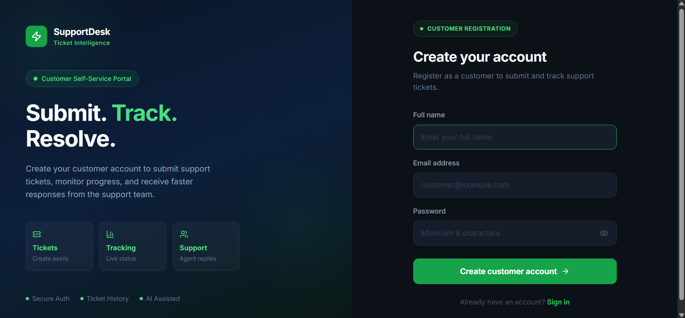
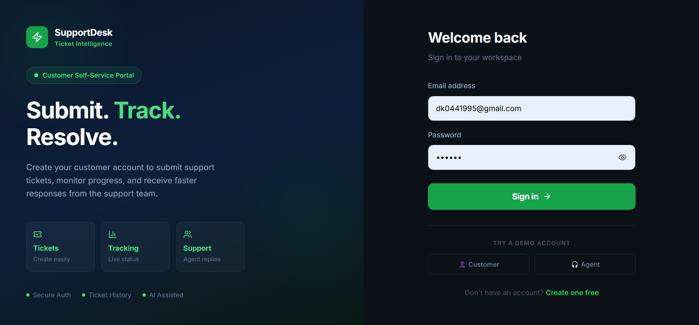
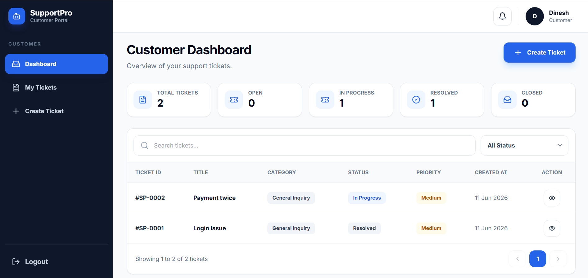
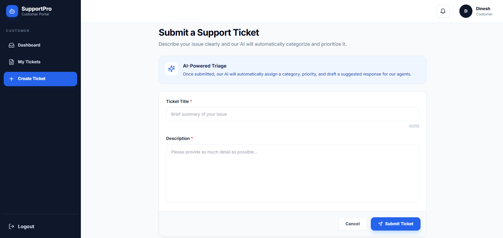
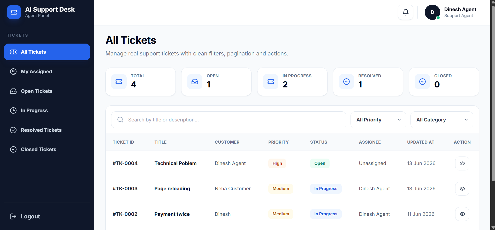
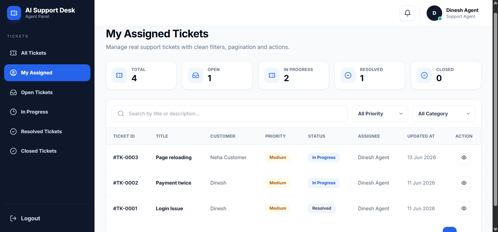

<div align="center">

# 🎫 SupportDesk — AI-Powered Support Ticket Platform

SupportDesk is an AI-powered support ticket management platform that helps businesses efficiently manage, track, prioritize, and resolve customer support requests from a centralized system.

## Why did I create this project?
I created this project to solve the challenges of manual customer support processes such as lost requests, delayed responses, lack of prioritization, and poor communication by providing AI-powered ticket triage, real-time notifications, and structured support workflows.

[](https://smart-support-ticket-platform.onrender.com)
[](https://spring.io/projects/spring-boot)
[](https://react.dev/)
[](https://www.anthropic.com/)
[](LICENSE)

</div>

---

## 🌐 Live Demo

> **Try it now → [https://support-ticket-frontend-1n7g.onrender.com/](https://support-ticket-frontend-1n7g.onrender.com/)**

Use the pre-seeded accounts below — no signup needed:

| Role | Email | Password |
|---|---|---|
| 🧑‍💼 **Agent** | `agent1@example.com` | `password123` |
| 👤 **Customer** | `customer1@example.com` | `password123` |
| 🧑‍💼 **Agent 2** | `agent2@example.com` | `password123` |
| 👤 **Customer 2** | `customer2@example.com` | `password123` |

> ⚠️ Hosted on Render free tier — first load may take ~30s to wake up.

---

## Preview

<div align="center">

<table>
  <tr>
    <td align="center">
      
      <br/>
      <sub><b>📃Register Customer Page</b></sub>
    </td>
    <td align="center">
      
      <br/>
      <sub><b>📃Login Customer and Agent Page</b></sub>
    </td>
  </tr>
  <tr>
    <td align="center">
      
      <br/>
      <sub><b>📚 Customer Dashboard</b></sub>
    </td>
    <td align="center">
      
      <br/>
      <sub><b>📺 Customer Create Ticket</b></sub>
    </td>
  </tr>
    <tr>
    <td align="center">
      
      <br/>
      <sub><b>📚 Agent Dashboard</b></sub>
    </td>
    <td align="center">
      
      <br/>
      <sub><b>📃 Agent Assigned Ticket</b></sub>
    </td>
  </tr>
</table>

</div>

---

## ✨ Features

### 🤖 AI-Powered Triage
Every new ticket is automatically **categorized** (Billing, Technical, Account Access, etc.) and **prioritized** (Low → Critical) by Anthropic Claude. A draft agent response is also suggested. Falls back gracefully to a rule-based keyword engine if the API is unavailable — so the system always works.

### 🔔 Real-Time Notifications
WebSocket (STOMP over SockJS) pushes instant in-app notifications to agents when tickets arrive and to customers when agents respond — no polling, no refresh needed.

### 📋 Immutable Audit Trail
Every ticket state change (status, priority, assignment, comment) is recorded in an append-only `audit_logs` table. Full history is visible on each ticket — useful for compliance, debugging, and dispute resolution.

### 📊 Analytics Dashboard
Agents see live ticket counts broken down by status, priority, and category. Built on a dedicated `GET /api/tickets/analytics` endpoint.

### 🔐 Role-Based Access Control
Three roles: **Customer** (creates & views own tickets), **Agent** (manages all tickets, assigns, resolves), **Admin**. Route guards enforced on both frontend (React) and backend (Spring Security).

### 💬 Threaded Comments
Customers and agents can communicate via threaded comments on each ticket. Comments on closed tickets are blocked by design.

---

## 🖥️ Tech Stack

### Backend
| Technology | Purpose |
|---|---|
| Java 21 + Spring Boot 3.2 | Core framework, virtual threads |
| Spring Security + JWT (JJWT 0.12) | Stateless authentication |
| Spring Data JPA + Hibernate | ORM, repository pattern |
| Spring WebSocket + STOMP | Real-time push notifications |
| WebClient (Reactor) | Non-blocking Anthropic API calls |
| PostgreSQL 16 (prod) / H2 (dev) | Database |
| Flyway | Schema migrations (prod only) |
| Springdoc OpenAPI | Swagger UI auto-documentation |
| Docker + Docker Compose | Containerized deployment |

### Frontend
| Technology | Purpose |
|---|---|
| React 18 + TypeScript | UI framework with type safety |
| React Router v6 | Client-side SPA routing |
| TanStack Query v5 | Server state, caching, background refetch |
| Zustand | Auth/session state |
| Axios + interceptors | HTTP client with JWT injection |
| Tailwind CSS v3 | Utility-first styling |
| Vite | Build tool, sub-second HMR |
| SockJS + STOMP.js | WebSocket client |

---

## 🏗️ Architecture Overview

```
Browser (React 18 + TypeScript)
    │  REST + WebSocket (STOMP/SockJS)
    ▼
Spring Boot 3.2 (Java 21)
  ├── JwtAuthenticationFilter  →  SecurityContextHolder
  ├── Controllers              →  Services  →  Repositories
  ├── AiTriageService          →  Anthropic API (with fallback)
  └── NotificationService      →  WebSocket broker  →  Client push
    │
    ├── PostgreSQL 16  (tickets, users, comments, audit_logs, notifications)
    └── Anthropic Claude API  (category + priority + draft response)
```

> 📄 **Full architecture details** → [`ARCHITECTURE.md`](ARCHITECTURE.md)

---

## 🚀 Quick Start (No Docker)

### Prerequisites
- Java 21+, Maven 3.9+
- Node.js 20+, npm 10+

### 1. Clone
```bash
git clone https://github.com/your-username/support-ticket-platform.git
cd support-ticket-platform
```

### 2. Start Backend
```bash
cd backend
mvn spring-boot:run
```
Backend → `http://localhost:8080`
- Swagger UI: `http://localhost:8080/swagger-ui.html`
- H2 Console: `http://localhost:8080/h2-console` (URL: `jdbc:h2:mem:supportdb`, user: `sa`, password: *(blank)*)

### 3. Start Frontend
```bash
cd ../frontend
npm install
npm run dev
```
Frontend → `http://localhost:5173`

> ✅ Sample users are **auto-seeded** in dev mode. Password for all: `password123`

---

## 🐳 Docker Compose (Full Stack)

```bash
# Optional: set your Anthropic API key
export ANTHROPIC_API_KEY=sk-ant-...

# Start everything (PostgreSQL + Backend + Frontend)
docker-compose up -d

# View logs
docker-compose logs -f
```

App → `http://localhost`

---

## ⚙️ Environment Variables

### Backend

| Variable | Default | Description |
|---|---|---|
| `SPRING_PROFILES_ACTIVE` | `dev` | Set `prod` for PostgreSQL |
| `DATABASE_URL` | H2 (dev) | `jdbc:postgresql://host:5432/dbname` |
| `DATABASE_USERNAME` | `sa` | PostgreSQL username |
| `DATABASE_PASSWORD` | *(blank)* | PostgreSQL password |
| `JWT_SECRET` | ⚠️ insecure default | **Change in prod!** Min 32 chars |
| `ANTHROPIC_API_KEY` | *(blank)* | Optional — falls back to rule-based triage |
| `CORS_ORIGINS` | `http://localhost:5173` | Comma-separated allowed origins |
| `PORT` | `8080` | Server port |

### Frontend

| Variable | Default | Description |
|---|---|---|
| `VITE_API_URL` | `/api` | Backend API base URL |

---

## 📡 API Reference

Swagger UI: **`http://localhost:8080/swagger-ui.html`**

### Endpoints

| Method | Path | Auth | Description |
|---|---|---|---|
| `POST` | `/api/auth/register` | Public | Register (CUSTOMER or AGENT) |
| `POST` | `/api/auth/login` | Public | Login → receive JWT |
| `GET` | `/api/auth/me` | Any | Current user info |
| `POST` | `/api/tickets` | Customer | Create ticket (AI triage runs automatically) |
| `GET` | `/api/tickets` | Any | List tickets — filtered, paginated, searchable |
| `GET` | `/api/tickets/:id` | Any | Ticket detail |
| `PATCH` | `/api/tickets/:id` | Agent | Update status / priority / assignment |
| `POST` | `/api/tickets/:id/comments` | Any | Add comment |
| `GET` | `/api/tickets/:id/comments` | Any | Get paginated comments |
| `GET` | `/api/tickets/:id/audit-logs` | Any | Full audit trail |
| `GET` | `/api/tickets/analytics` | Agent | Stats by status, priority, category |
| `GET` | `/api/users/agents` | Agent | Agent list (for assignment dropdown) |

### Ticket Filters (`GET /api/tickets`)

| Param | Type | Options |
|---|---|---|
| `search` | string | Free text (title + description) |
| `status` | enum | `OPEN` `IN_PROGRESS` `RESOLVED` `CLOSED` |
| `priority` | enum | `LOW` `MEDIUM` `HIGH` `CRITICAL` |
| `category` | enum | `BILLING` `TECHNICAL_ISSUE` `ACCOUNT_ACCESS` `FEATURE_REQUEST` `GENERAL_INQUIRY` |
| `assigneeId` | long | Filter by assigned agent |
| `page` | int | 0-based |
| `size` | int | Default 10, max 100 |
| `sortBy` | string | Default `createdAt` |
| `sortDir` | string | `asc` or `desc` |

---

## ☁️ Production Deployment

### Render / Railway / Fly.io (Backend)

1. Connect GitHub repo
2. **Build:** `cd backend && mvn clean package -DskipTests`
3. **Start:** `java -jar backend/target/support-ticket-platform-1.0.0.jar`
4. Set env vars:
```
SPRING_PROFILES_ACTIVE=prod
DATABASE_URL=jdbc:postgresql://...
DATABASE_USERNAME=...
DATABASE_PASSWORD=...
JWT_SECRET=<min-32-char-random-string>
ANTHROPIC_API_KEY=sk-ant-...
CORS_ORIGINS=https://your-frontend.vercel.app
```

### Vercel / Netlify (Frontend)

- Root: `frontend/`
- Build: `npm run build`
- Output: `dist`
- Env: `VITE_API_URL=https://your-backend.onrender.com/api`

### PostgreSQL (Production)
```sql
CREATE DATABASE supportticketdb;
CREATE USER supportuser WITH PASSWORD 'your-password';
GRANT ALL PRIVILEGES ON DATABASE supportticketdb TO supportuser;
```
Flyway runs migrations automatically on first boot.

---

## 📁 Project Structure

```
support-ticket-platform/
│
├── backend/
│   └── src/main/java/com/supportticket/
│       ├── config/         # Security, WebSocket, CORS, DataSeeder
│       ├── controller/     # REST + WebSocket controllers
│       ├── dto/            # Request / Response DTOs
│       ├── entity/         # JPA entities (Ticket, User, Comment, AuditLog)
│       ├── enums/          # Role, TicketStatus, Priority, Category
│       ├── exception/      # GlobalExceptionHandler + custom exceptions
│       ├── repository/     # Spring Data JPA (with custom JPQL)
│       ├── security/       # JwtFilter + JwtService + UserDetailsService
│       ├── service/        # Interfaces + implementations
│       └── util/           # Entity → DTO mappers
│
├── frontend/src/
│   ├── api/                # Axios calls (auth, tickets, users, notifications)
│   ├── components/         # Reusable UI (common, layout, tickets)
│   ├── hooks/              # useNotifications (WebSocket hook)
│   ├── pages/              # LoginPage, CustomerDashboard, AgentDashboard,
│   │                       # TicketDetailPage, CreateTicketPage
│   ├── store/              # Zustand auth store
│   ├── types/              # Shared TypeScript interfaces
│   └── utils/              # helpers, formatters
│
├── docker-compose.yml      # Full stack: postgres + backend + frontend
├── docker-compose.dev.yml  # Dev: postgres only
├── ARCHITECTURE.md         # Deep-dive architecture & design decisions
└── README.md               # This file
```

---

## 🔮 What I'd Build Next

| Priority | Feature | Approach |
|---|---|---|
| 🔴 | Async AI triage (remove latency) | Spring `@Async` or RabbitMQ |
| 🔴 | Refresh tokens + `httpOnly` cookies | Sliding expiry, secure cookie |
| 🔴 | Email notifications | Spring Mail + async job |
| 🟡 | Rate limiting on auth endpoints | `bucket4j` per-IP |
| 🟡 | File attachments (screenshots/logs) | S3 / MinIO presigned URLs |
| 🟡 | SLA auto-escalation | `@Scheduled` job + priority rules |
| 🟡 | Unit + integration tests | MockMvc + Mockito + Testcontainers |
| 🟢 | Full-text search | PostgreSQL `tsvector` / Elasticsearch |
| 🟢 | Observability | OpenTelemetry + Prometheus + Grafana |

---

## 🧠 Design Decisions & Assumptions

1. **Synchronous AI triage** — runs inline with ticket creation. Adds ~300–800ms latency but keeps the system simple. At scale, this moves to an async queue.
2. **JWT in `localStorage`** — chosen for simplicity. Production hardening: `httpOnly` + `Secure` cookies (eliminates XSS token theft).
3. **Single `users` table with `role` column** — all user types share identical fields; RBAC is a permission level, not a data model difference.
4. **Audit log is append-only** — no UPDATE/DELETE on `audit_logs` to preserve tamper-evident history.
5. **Rule-based triage fallback** — system is fully functional without an API key. Fallback regex patterns cover real support vocabulary.
6. **Agent accounts created at registration** — in production, agents would be provisioned by an admin. Simplified for MVP.
7. **Comments blocked on closed tickets** — prevents stale activity. Could be made configurable via an admin setting.

---

## Author

**Dinesh Kushwaha**  
Full-Stack Developer — building productivity tools, SaaS platforms.

[](https://www.linkedin.com/in/mrdinesh-kushwaha/)

---

<div align="center">

*Built with focus, for focused people.*

⭐ If this extension helps you stay on track, consider giving it a star!

</div>
